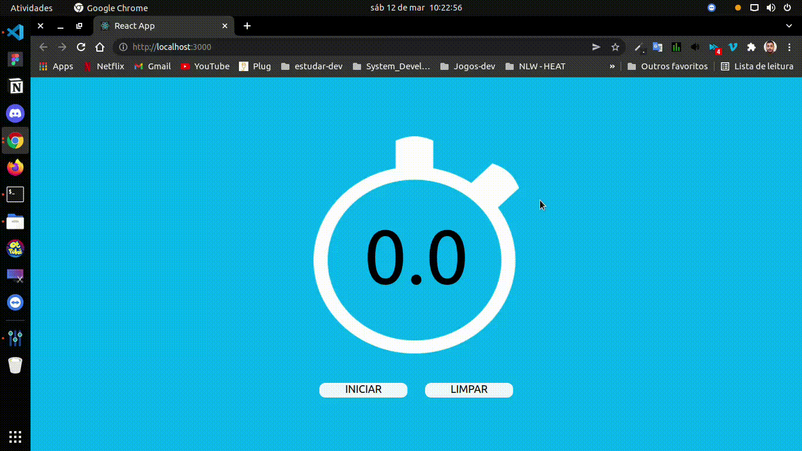

# Cronometro em React.JS

###  Desenvolvido projeto em react que faz contagem de tempo em centésimo de segundos, conseguimos pausar o tempo e reiniciar.

Projeto simples para testar nível de conhecimento e praticar técnicas na linguagem.

